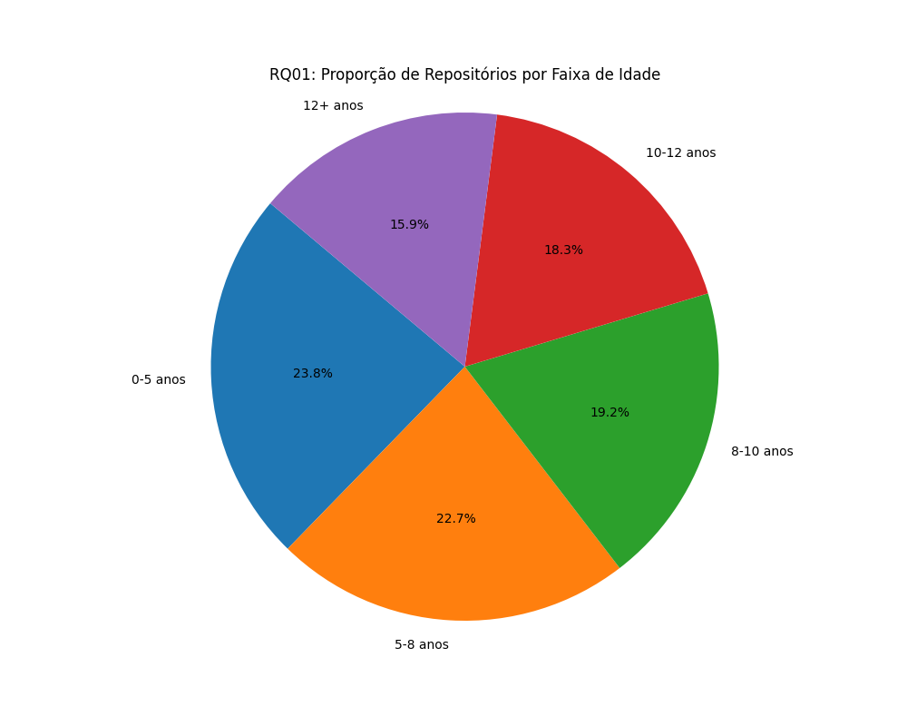
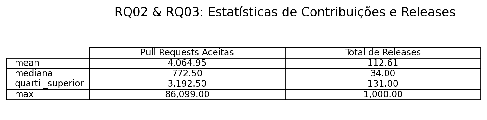
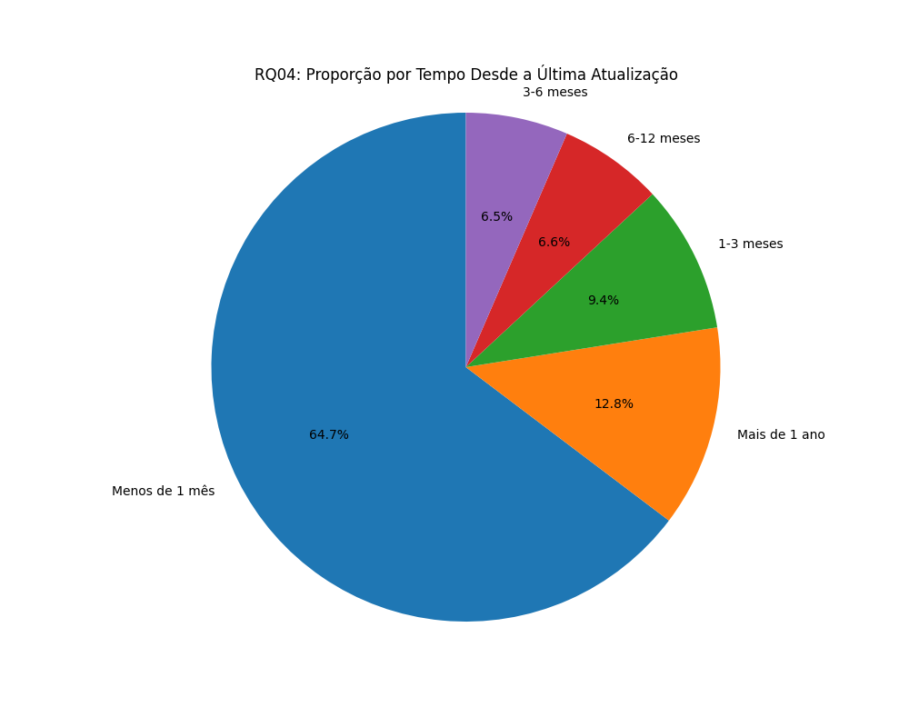
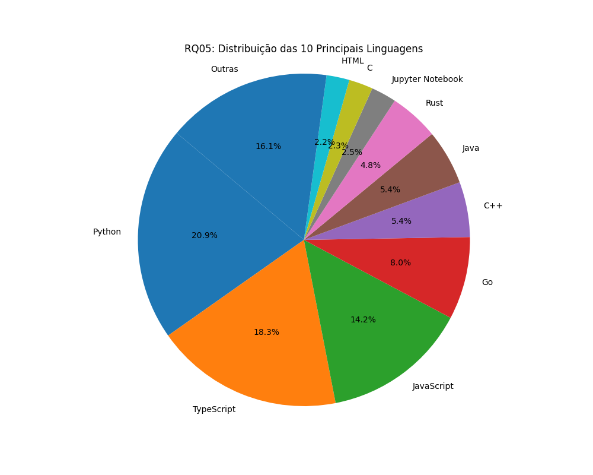
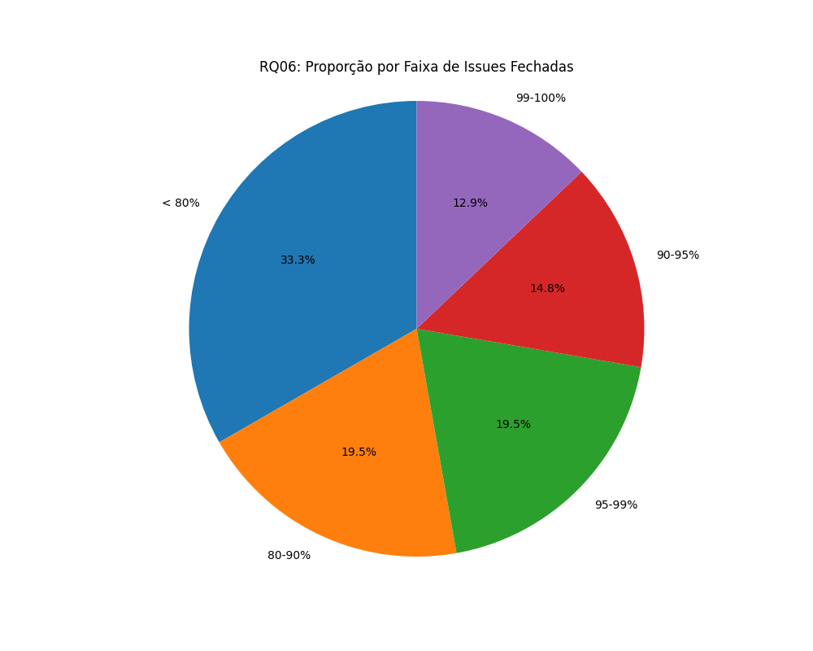
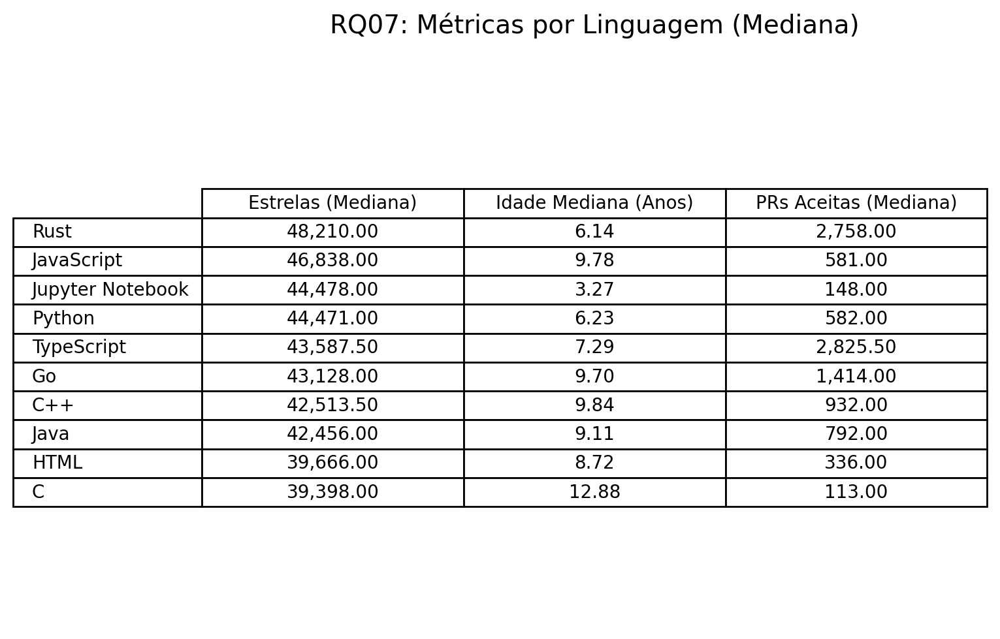

# Análise dos 1000 Repositórios Mais Populares do GitHub

## Resumo

Este estudo analisa os 1000 repositórios mais populares do GitHub, classificados pelo número de estrelas, para identificar padrões em seis áreas principais: idade, contribuições externas, frequência de releases, regularidade de atualizações, linguagens de programação e gerenciamento de *issues*. Os resultados mostram que os repositórios populares são tipicamente projetos maduros, com manutenção ativa e desenvolvidos predominantemente em linguagens como Python, TypeScript e JavaScript.

---

## 1. Introdução

Neste laboratório, investigamos os 1000 repositórios mais estrelados do GitHub para identificar características comuns que contribuem para seu sucesso e sustentabilidade. A análise busca validar um conjunto de hipóteses sobre maturidade, colaboração, manutenção e tecnologia.

### Questões de Pesquisa e Hipóteses

As hipóteses formuladas no início do projeto foram:
* **H1 (Idade):** Repositórios populares tendem a ser projetos maduros (mais antigos).
* **H2 (Contribuições):** Repositórios populares recebem muitas contribuições externas.
* **H3 (Releases):** Repositórios populares lançam novas versões (*releases*) frequentemente.
* **H4 (Atualizações):** Repositórios populares são atualizados com regularidade.
* **H5 (Linguagens):** As linguagens mais comuns são *mainstream* como JavaScript e Python.
* **H6 (Manutenção):** Repositórios populares possuem uma boa taxa de resolução de *issues*.

---

## 2. Metodologia

### Coleta e Análise dos Dados
Os dados foram coletados da API GraphQL do GitHub através de um *script* em Python. As métricas extraídas foram processadas para calcular a idade dos repositórios, o tempo desde a última atualização e o percentual de *issues* fechadas. A análise utilizou medianas para dados numéricos e distribuições de frequência para dados categóricos.

### Visualização
Para apresentar os resultados, foram gerados gráficos de pizza para visualizar proporções e tabelas para exibir dados estatísticos detalhados, utilizando as bibliotecas `matplotlib` e `pandas`.

---

## 3. Resultados e Discussão

A seguir, cada hipótese é confrontada com os dados analisados.

### H1: Repositórios populares são projetos maduros (mais antigos)
* **Resultado:** Quase 70% dos repositórios têm mais de 8 anos de existência.
* **Hipótese:** **Confirmada.** A popularidade está fortemente correlacionada com o tempo, que permite a construção de uma comunidade sólida e a consolidação do projeto.

 

|  |
|:---:|
| **Figura 1:** Proporção de Repositórios por Faixa de Idade. A maior fatia (38.8%) corresponde a projetos com mais de 12 anos. |

 

### H2 & H3: Contribuições Externas e Frequência de Releases
* **Resultado:** A mediana de *pull requests* (PRs) aceitas é de **929** e a de *releases* é **45**.
* **Hipótese (H2):** **Confirmada.** Repositórios populares atraem um número significativo de contribuições.
* **Hipótese (H3):** **Parcialmente confirmada.** O uso de *releases* é comum, mas varia muito, indicando que não é um indicador universal de popularidade.

 

|  |
|:---:|
| **Figura 2:** Tabela de Estatísticas de Contribuições e Releases. A tabela mostra a média, mediana e valores máximos, destacando a grande variação nos dados. |

 

### H4: Repositórios populares são atualizados com regularidade
* **Resultado:** Cerca de **83%** dos repositórios foram atualizados há menos de um mês.
* **Hipótese:** **Confirmada.** Manutenção constante e desenvolvimento ativo são características chave de projetos populares.

 

|  |
|:---:|
| **Figura 3:** Proporção por Tempo Desde a Última Atualização. A esmagadora maioria dos projetos mostra atividade recente. |

 

### H5: Repositórios populares utilizam linguagens mainstream
* **Resultado:** **Python** (20.9%), **TypeScript** (18.3%) e **JavaScript** (14.2%) são as linguagens dominantes.
* **Hipótese:** **Confirmada.** As três principais linguagens somam mais da metade dos repositórios analisados.

 

|  |
|:---:|
| **Figura 4:** Distribuição das 10 Principais Linguagens. Python, TypeScript e JavaScript confirmam sua popularidade no ecossistema open-source. |

 

### H6: Repositórios populares possuem boa manutenção
* **Resultado:** Mais de **87%** dos repositórios fecham mais de 90% de suas *issues*.
* **Hipótese:** **Confirmada.** Uma boa manutenção, refletida na alta taxa de resolução de *issues*, é um pilar dos projetos de sucesso.

 

|  |
|:---:|
| **Figura 5:** Proporção por Faixa de Issues Fechadas. A maior parte dos projetos demonstra uma altíssima capacidade de gerenciar os problemas reportados. |

 

### Análise Comparativa por Linguagem (Bônus)

Ao analisar as métricas por linguagem, observamos padrões interessantes:
* **Rust** se destaca com a maior mediana de estrelas.
* Projetos em **JavaScript** e **C++** tendem a ser mais antigos.
* **TypeScript** lidera na mediana de Pull Requests aceitas entre as linguagens mais populares.

 

|  |
|:---:|
| **Figura 6:** Tabela de Métricas por Linguagem (Mediana). A tabela compara a performance mediana de cada linguagem, revelando os pontos fortes de cada ecossistema. |

 

---

## 4. Conclusão

A análise confirma que a popularidade no GitHub é resultado de um conjunto de características observáveis. Projetos populares são, em sua maioria, **maduros, ativamente mantidos e com forte engajamento comunitário**. A escolha de tecnologias consolidadas como Python, TypeScript e JavaScript também desempenha um papel fundamental. Os dados mostram que, para um projeto de código aberto prosperar, ele precisa de uma base técnica sólida, uma comunidade ativa e mantenedores responsivos.