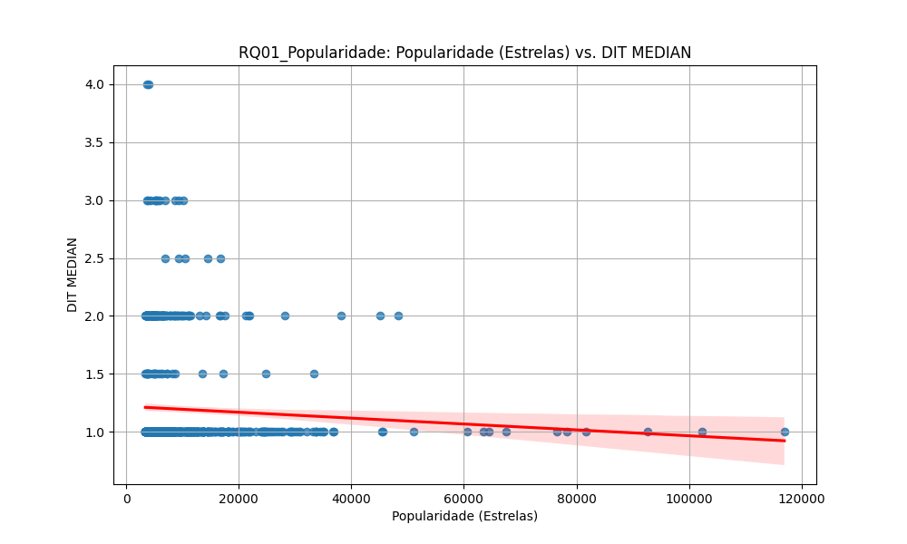
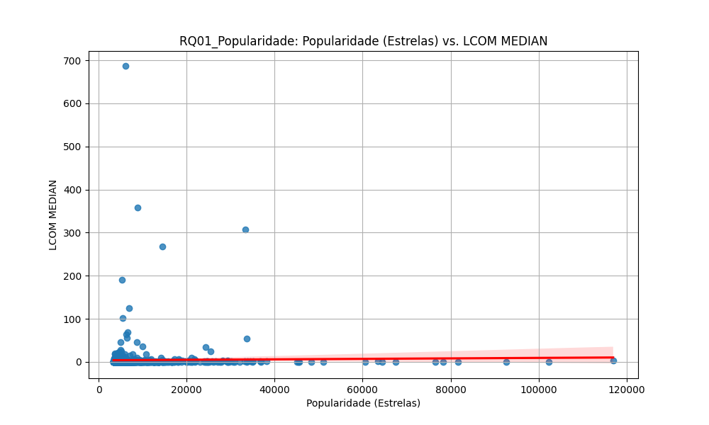
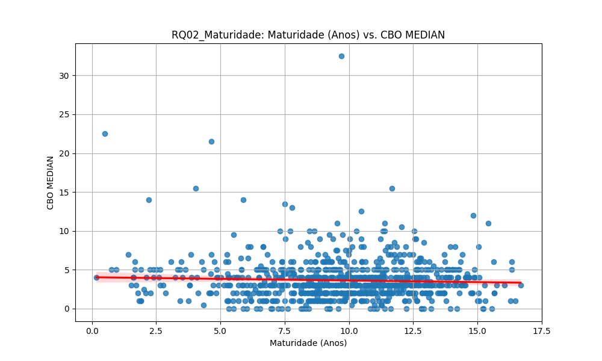
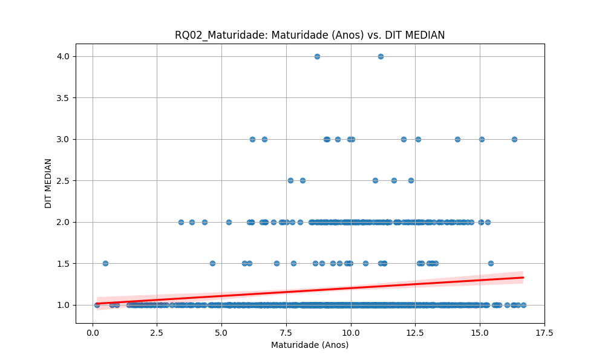
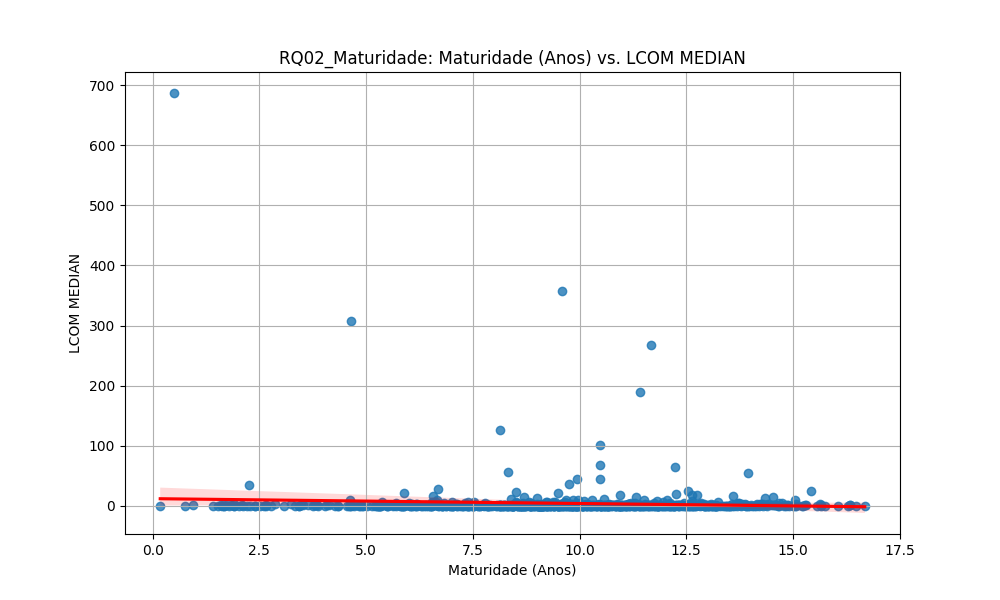
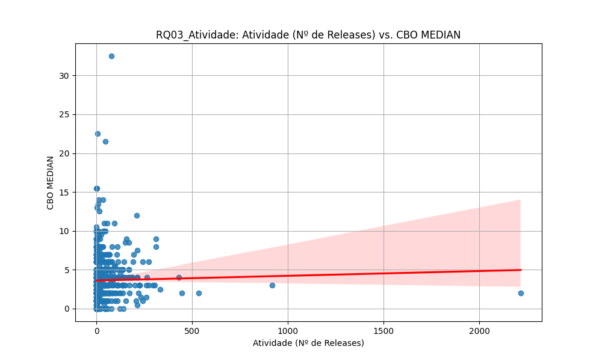
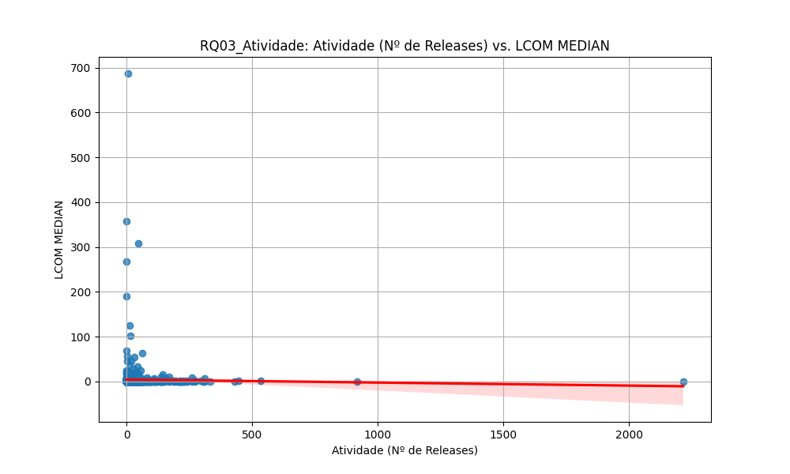
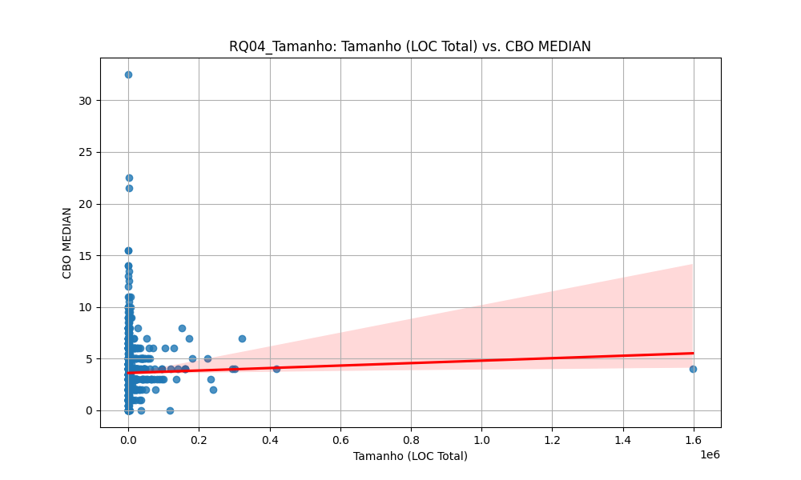
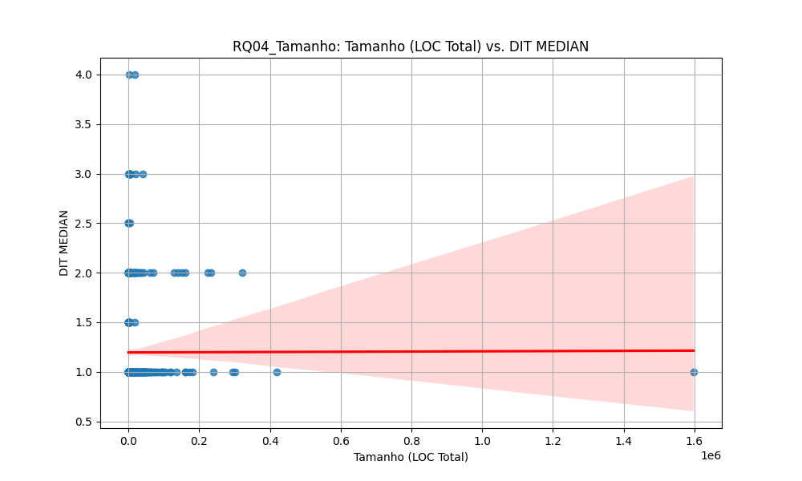
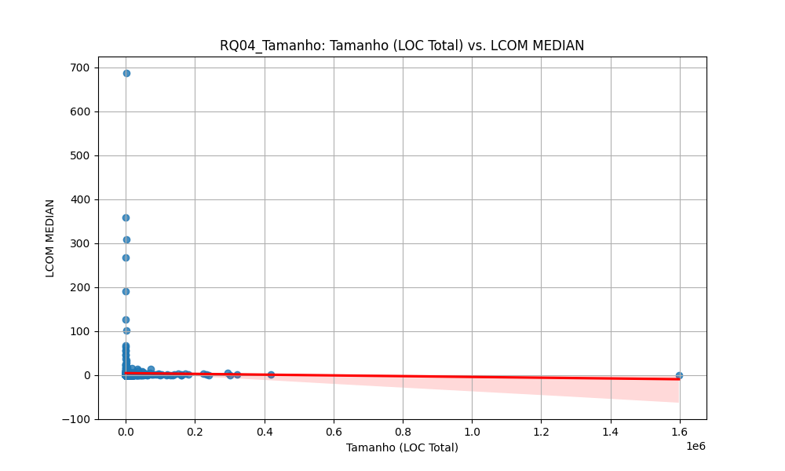

# Relatório Final: Um Estudo das Características de Qualidade de Sistemas Java

## 1. Introdução

No processo de desenvolvimento de sistemas open-source, em que diversos desenvolvedores contribuem em partes diferentes do código, um dos riscos a serem gerenciados diz respeito à evolução dos seus atributos de qualidade interna. Isto é, ao se adotar uma abordagem colaborativa, corre-se o risco de tornar vulnerável aspectos como modularidade, manutenibilidade, ou legibilidade do software produzido. Para tanto, diversas abordagens modernas buscam aperfeiçoar tal processo, através da adoção de práticas relacionadas à revisão de código ou à análise estática através de ferramentas de CI/CD.

Neste contexto, o objetivo deste laboratório é analisar aspectos da qualidade de repositórios desenvolvidos na linguagem Java, correlacionando-os com características do seu processo de desenvolvimento, sob a perspectiva de métricas de produto calculadas através da ferramenta CK.

Nossas **hipóteses informais** antes da análise eram:
- **H1 (Popularidade):** Repositórios mais populares teriam *melhor* qualidade (menor CBO e LCOM).
- **H2 (Maturidade):** Repositórios mais maduros (antigos) teriam *pior* qualidade (maior CBO), refletindo o acúmulo de débito técnico.
- **H3 (Atividade):** Repositórios mais ativos (com mais releases) teriam *melhor* qualidade.
- **H4 (Tamanho):** Repositórios maiores (com mais linhas de código) teriam *pior* qualidade (maior CBO).

## 2. Metodologia

### 2.1 Seleção de Repositórios
Com o objetivo de analisar repositórios relevantes, o escopo deste estudo abrange os **top-1.000 repositórios Java mais populares do GitHub**, ordenados pelo número de estrelas.

### 2.2 Questões de Pesquisa
Este laboratório tem o objetivo de responder às seguintes questões de pesquisa:
- **RQ01:** Qual a relação entre a popularidade dos repositórios e as suas características de qualidade?
- **RQ02:** Qual a relação entre a maturidade dos repositórios e as suas características de qualidade?
- **RQ03:** Qual a relação entre a atividade dos repositórios e as suas características de qualidade?
- **RQ04:** Qual a relação entre o tamanho dos repositórios e as suas características de qualidade?

### 2.3 Definição de Métricas
Para cada questão de pesquisa, realizou-se a comparação entre as características do processo de desenvolvimento e as métricas de qualidade.
* **Métricas de Processo:**
    * **Popularidade:** Número de estrelas.
    * **Tamanho:** Soma total de linhas de código (LOC).
    * **Atividade:** Número de releases.
    * **Maturidade:** Idade do repositório em anos.
* **Métricas de Qualidade:**
    * **CBO (Coupling between objects):** Acoplamento entre objetos.
    * **DIT (Depth Inheritance Tree):** Profundidade da árvore de herança.
    * **LCOM (Lack of Cohesion of Methods):** Falta de coesão dos métodos.

### 2.4 Coleta e Análise de Dados
Para a coleta dos metadados de processo, utilizou-se um script Python que consome a **API REST do GitHub**. Para a medição dos valores de qualidade, foi empregada a ferramenta de análise estática **CK (versão 0.7.1)**. Um pipeline automatizado foi desenvolvido para clonar cada um dos 1.000 repositórios, identificar heuristicamente o diretório de código-fonte principal, executar o CK e salvar os resultados.

Os dados de métricas de qualidade, gerados no nível de classe, foram sumarizados por repositório utilizando a **mediana** como medida de tendência central. A análise da correlação foi realizada através da geração de **gráficos de dispersão (scatter plots)** com linha de regressão.

## 3. Resultados

A seguir, são apresentados os resultados obtidos para cada Questão de Pesquisa.

### RQ01: Relação entre Popularidade e Qualidade

**Análise:** A análise visual dos gráficos que comparam a popularidade com as métricas de CBO, DIT e LCOM não revela correlações fortes. Em todos os casos, a nuvem de pontos é extremamente densa em projetos com menor popularidade e se dispersa amplamente. As linhas de regressão (vermelhas) são quase horizontais, indicando que um aumento na popularidade não está associado a uma mudança clara (positiva ou negativa) na qualidade do código.

---

### RQ02: Relação entre Maturidade e Qualidade

**Análise:** A relação entre a maturidade (idade) e a qualidade do código também se mostrou fraca. Para CBO e LCOM, as linhas de regressão são praticamente planas. Para o DIT, observa-se uma tendência positiva extremamente sutil, mas a grande variabilidade dos dados torna a relação pouco confiável.

---

### RQ03: Relação entre Atividade e Qualidade

**Análise:** A atividade, medida pelo número de releases, também não demonstrou ser um forte preditor de qualidade. A grande maioria dos projetos possui um número baixo de releases, e não é possível identificar qualquer padrão ou tendência clara que relacione a atividade com a qualidade do código.

---

### RQ04: Relação entre Tamanho e Qualidade

**Análise:** Contrariando a hipótese inicial, mesmo o tamanho do projeto (LOC Total) não apresentou uma correlação forte com as métricas de qualidade. As linhas de regressão para CBO, LCOM e DIT são quase perfeitamente planas, indicando uma correlação muito fraca ou inexistente.

## 4. Discussão e Conclusão

Os resultados obtidos através da análise visual refutaram a maioria das hipóteses informais. Fatores externos como **popularidade (H1)**, **maturidade (H2)**, **atividade (H3)** e **tamanho (H4)** não mostraram correlações fortes com as métricas de qualidade interna analisadas.

A ausência generalizada de correlações lineares sugere que a qualidade de software, medida por CBO, DIT e LCOM, é um fenômeno complexo, provavelmente influenciado por fatores não medidos neste estudo, como a cultura da equipe de desenvolvimento e a rigidez dos processos de revisão de código.

Em conclusão, este estudo empírico demonstrou que as características de processo de um projeto de software são preditores fracos de sua qualidade estrutural interna. A qualidade parece ser um atributo intrínseco, governado por fatores mais complexos do que seus metadados externos.