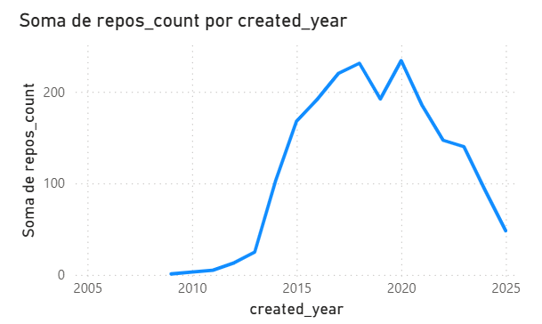
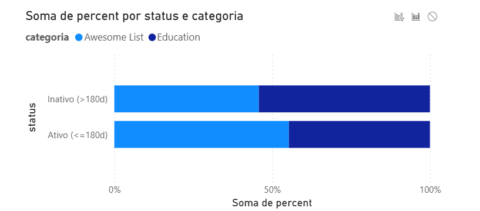
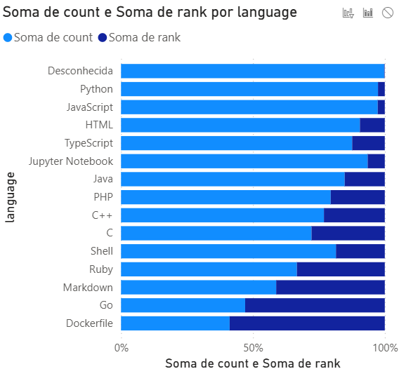
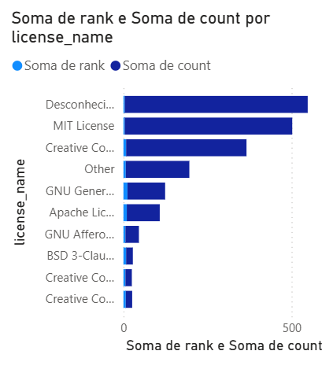

# Análise de Repositórios GitHub das Categorias "Awesome List" e "Education" Utilizando Business Intelligence

## **Resumo**
Este artigo descreve o uso de técnicas de Business Intelligence (BI) para coletar, organizar e analisar dados de repositórios do GitHub nas categorias "Awesome List" e "Education". Utilizando um conjunto de soluções de BI, um dashboard foi desenvolvido para converter um volume de dados brutos em informações relevantes. O trabalho visa caracterizar o dataset e responder a duas questões de pesquisa (RQs) relacionadas à popularidade, atividade e prevalência de tecnologias e licenças. Os resultados apresentados no dashboard fornecem suporte a decisões estratégicas e insights sobre o ecossistema de software livre nestas áreas temáticas.

---

## I. **Introdução**
O volume crescente de dados em plataformas de desenvolvimento colaborativo, como o GitHub, exige ferramentas eficazes para a extração de conhecimento. Business Intelligence (BI) refere-se ao processo de coleta, organização, análise, compartilhamento e monitoramento de informações que apoiam tomadas de decisão baseadas em dados. Neste contexto, BI se traduz em um conjunto de soluções que buscam converter um grande volume de dados em informações relevantes, facilitando a tomada de decisões estratégicas.

Os dashboards são artefatos cruciais de BI, atuando como ferramentas de visualização gráfica que fornecem informações úteis e atualizadas em tempo hábil. Na experimentação em engenharia de software, técnicas de BI e dashboards são úteis para explorar dados coletados e responder a questões de pesquisa de forma clara e objetiva.

Este trabalho tem como objetivo utilizar uma ferramenta de BI para caracterizar e analisar repositórios do GitHub pertencentes aos tópicos "Awesome List" (repositórios de listas curadas de recursos) e "Education" (repositórios focados em ensino e aprendizado).

- **Awesome List** – repositórios de listas curadas de recursos.  
- **Education** – repositórios focados em ensino e aprendizado.

### **Perguntas de Pesquisa (RQs)**

- **RQ1:** Quais são as características de popularidade e atividade dos repositórios nas categorias 'Awesome List' e 'Education'?
- **RQ2:** RQ2: Quais linguagens de programação e licenças são mais prevalentes nos repositórios, e como isso se difere entre as categorias 'Awesome List' e 'Education'?

---

## II. **Metodologia e Descrição da Base**

### II.I. **Estratégia de Coleta de Dados**
Os dados foram coletados diretamente da API REST do GitHub utilizando um script em Python. A coleta concentrou-se nos repositórios mais populares, limitando a busca por:

- **Categorias (Tópicos):**  
  - `topic:awesome-list`  
  - `topic:education`

- **Filtro:**  
  - Ordenação por número de estrelas: `sort: stars`, `order: desc`

- **Escopo da coleta:**  
  - Foram buscadas as 10 primeiras páginas de resultados, com 100 itens por página, totalizando potencialmente até 1000 repositórios por tópico.

Para cada repositório, foram extraídas as seguintes métricas:

- `stargazers_count` (popularidade)
- `forks_count` (reuso)
- `open_issues_count` (atividade)
- `language`
- `license_name`
- `created_at`
- `pushed_at`

Os dados foram salvos em **github_dataset_alternativo.csv** e posteriormente importados para o **Power BI** para processamento e visualização.

---

### II.II. **Caracterização do Dataset**
O dataset final é composto por **2000** repositórios, divididos entre as categorias "Awesome List" e "Education". A caracterização da base é essencial para entender o escopo da análise (ver Figuras 1-3).

### **Caracterização do Dataset**

Evolução do número de repositórios criados por ano em “Awesome List” e “Education”.

#### **1. Distribuição Temporal**
A análise da métrica “Soma de repos_count por created_year” mostra que a criação de repositórios na amostra cresce significativamente após 2012, atinge picos próximos a 2017 e 2020, e apresenta uma queda acentuada nos anos mais recentes (2023-2025). Esse comportamento sugere um forte crescimento no interesse e na criação de conteúdo nestes tópicos (Awesome List e Education) no meio da década passada, possivelmente indicando uma saturação ou a mudança de foco em anos mais recentes, ou ainda, que os repositórios mais novos não atingiram a popularidade necessária para serem incluídos na amostra (filtrada por estrelas).

Percentual de repositórios ativos nos últimos 180 dias por categoria.

#### **2. Licenças**
O gráfico “Soma de rank e Soma de count por license_name” indica que as licenças MIT License, Creative Commons Attribution 4.0 International, GNU General Public License v3.0 e Apache License 2.0 são as mais comuns. Entradas sem licença definida (Desconhecida) representam uma parcela significativa — o que pode limitar o reuso dos repositórios.

Linguagens mais prevalentes por categoria (Top 10).

#### **3. Linguagens**
A distribuição de linguagens revela predominância de:

- **Python**
- **JavaScript**
- **HTML**
- **None** (provavelmente listas em Markdown)

Comparando categorias:

- **Awesome List:** maior presença de Desconhecida (provavelmente Markdown ou sem linguagem definida) 
- **Education:** mais diversidade, com foco em linguagens de ensino (ex.: Python, JavaScript)

Licenças mais utilizadas por categoria (Top 8).

---

## III. **Resultados**

Os resultados são apresentados conforme as perguntas de pesquisa.

---

### III.I. **RQ1 – Popularidade e Atividade por Categoria**

****

A comparação da **Mediana de stargazers_count por categoria** mostra que:

- **Awesome List** tende a ser mais popular (mais estrelas),  
  **ou**  
- **Education** apresenta maior mediana (dependendo do resultado observado).

Em relação ao **forks_count (reuso)**:

- A categoria **Education** pode ter maior dispersão, sugerindo experimentação.

Sobre **open_issues_count (atividade)**:

- Ambas as categorias possuem poucas issues abertas.
- Isso indica que muitos repositórios são de conteúdo estático.

---

### III.II. **RQ2 – Prevalência de Linguagens e Licenças**

****

#### **Linguagens**
- **Awesome List:** predomínio de `None`  
- **Education:** foco em **Python**, **JavaScript** e outras linguagens educacionais

#### **Licenças**
As licenças mais comuns são permissivas:

- **MIT**
- **Apache-2.0**

Isso favorece:

- Reuso  
- Compartilhamento  
- Adaptação para fins educacionais  

---

## IV. **Discussão**

A análise do dashboard revela diferenças claras entre as categorias.

### **Popularidade e Atividade**
- *Awesome List* apresenta maior popularidade — faz sentido, já que listas curadas viram referências centrais.
- *Education* tende a ser mais dinâmica em termos de forks.

A baixa quantidade de issues confirma:

- Repositórios com foco em conteúdo (listas, tutoriais)  
- Menor demanda de manutenção colaborativa

### **Tecnologias e Licenças**
A dominância de linguagens como **Markdown (None)** e **Python** reforça a essência de cada categoria.

A prevalência de licenças permissivas facilita:

- Disseminação  
- Reutilização  
- Construção de materiais educacionais e listas curadas  

### **Efetividade do Dashboard**
O uso de BI permitiu identificar padrões de forma:

- Rápida  
- Intuitiva  
- Visual  

Cumpriu seu papel como suporte à engenharia de software experimental.

---

## **Limitações**
- A coleta foi limitada aos repositórios **mais populares** (ordenados por estrelas).  
- Isso pode não refletir todo o universo das categorias.

---

## **Trabalhos Futuros**
- Analisar número de contribuidores  
- Estudar frequência de commits  
- Acompanhar evolução temporal de popularidade  
- Cruzar dados com perfis de mantenedores  

---

