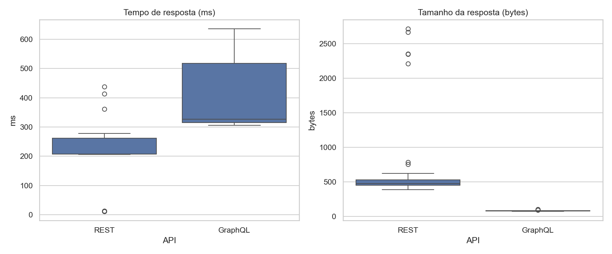
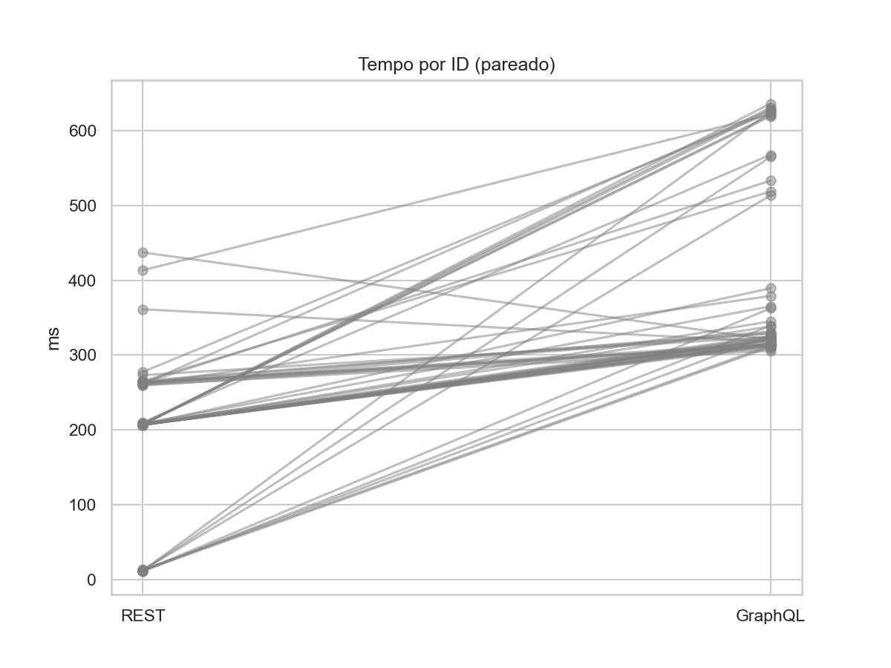
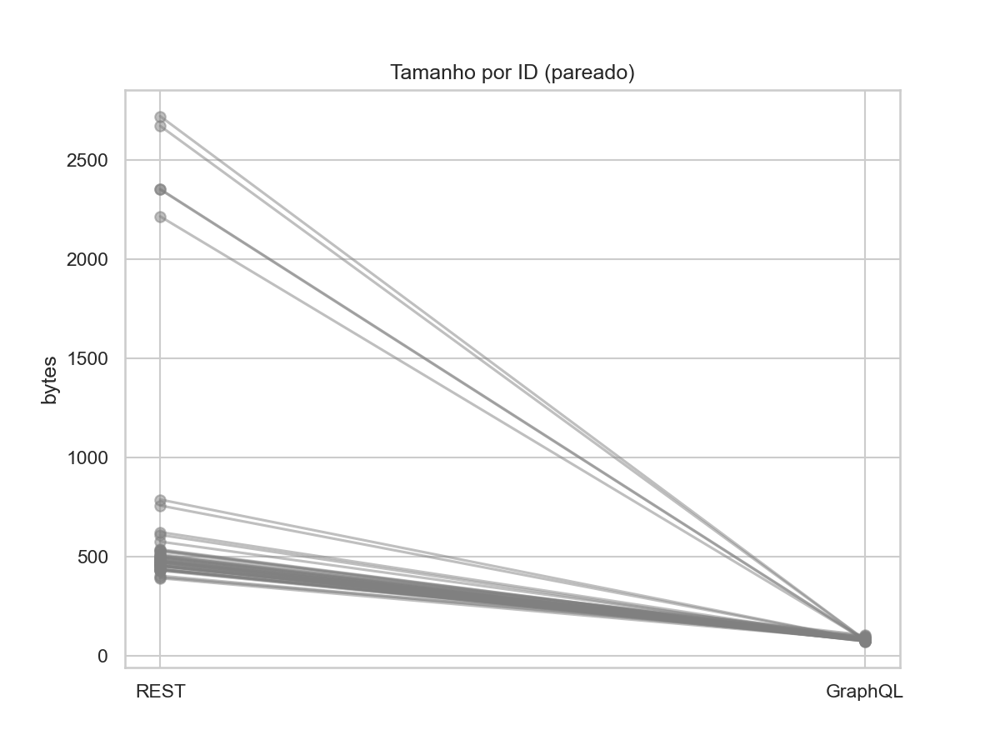

# Relatório Final – Lab05: GraphQL vs REST (Experimento Controlado)

## 1. Introdução
A linguagem de consulta GraphQL é uma alternativa às APIs REST tradicionais. Este relatório apresenta um experimento controlado para avaliar quantitativamente dois aspectos: (i) desempenho (tempo de resposta) e (ii) eficiência de payload (tamanho da resposta). As perguntas de pesquisa são:
- RQ1. Respostas às consultas GraphQL são mais rápidas que respostas às consultas REST?
- RQ2. Respostas às consultas GraphQL têm tamanho menor que respostas às consultas REST?

## 2. Hipóteses (H0/H1)
Usamos "média(X)" para a média da métrica (tempo/tamanho) na API X:

- RQ1. Respostas GraphQL são mais rápidas que respostas REST?
  - Hipótese nula:  
    H0_tempo: média(GraphQL) ≥ média(REST)
  - Hipótese alternativa:  
    H1_tempo: média(GraphQL) < média(REST)

- RQ2. Respostas GraphQL têm tamanho menor que respostas REST?
  - Hipótese nula:  
    H0_tamanho: média(GraphQL) ≥ média(REST)
  - Hipótese alternativa:  
    H1_tamanho: média(GraphQL) < média(REST)

  Nível de significância: α = 0,05.

## 3. Metodologia
### 3.1 Desenho Experimental
- Tipo: experimento controlado in-vitro com design pareado.
- Fator (variável independente): tipo de API (REST vs GraphQL).
- Variáveis dependentes: tempo de resposta (ms) e tamanho do corpo da resposta (bytes).
- Tratamentos:
  - REST (controle): GET do objeto completo (`/api/character/{id}`).
  - GraphQL (experimental): POST em `/graphql` consultando apenas `name`, `species`, `status`.
- Objetos experimentais: Rick and Morty API pública.
- Amostra: 50 personagens (IDs 1..50); total de 100 medições (50 REST + 50 GraphQL).
- Execução pareada: para cada ID, coletou-se REST e, em seguida, GraphQL (com pequeno `sleep`).
- Randomização: ordem dos IDs embaralhada com seed fixa (42).
- Warm-up: 1 requisição simples em cada API antes das medições para reduzir cold start.

### 3.2 Ambiente de Execução
- Python: 3.12.3
- Bibliotecas: requests=2.32.3, pandas=2.2.3, matplotlib=3.9.2, seaborn=0.13.2
- Parâmetros: timeout por requisição 20s; `sleep` entre requisições ≈ 0,1s.

### 3.3 Critérios de Validade e Mitigações
- Latência de rede: tratamentos intercalados e IDs embaralhados; ambos impactados por condições similares.
- Cold start do servidor: rodada de warm-up não contabilizada.
- Medição de tempo: cronômetro envolvendo somente a chamada de I/O (reduz processamento do cliente).
- Generalização: resultados específicos da API analisada; outras APIs/infraestruturas podem diferir.

## 4. Execução do Experimento
- Coleta automatizada gerando `experiment_results.csv` com colunas: `id`, `type`, `time_ms`, `size_bytes`, `status_code`, `ok`, `start_ts`, `end_ts`.
- Apenas respostas com `status_code = 200` foram consideradas na análise inferencial.
- Pares válidos (IDs com REST e GraphQL): 50.

## 5. Resultados
### 5.1 Estatísticas Descritivas (respostas 200)

| type    |   N |   Tempo (ms) — média |   Tempo (ms) — mediana |   Tempo (ms) — desvio padrão |   Tamanho (bytes) — média |   Tamanho (bytes) — mediana |   Tamanho (bytes) — desvio padrão |
|:--------|----:|---------------------:|-----------------------:|-----------------------------:|--------------------------:|----------------------------:|----------------------------------:|
| GraphQL |  50 |              401.56  |                326.12  |                      125.13  |                     81.78 |                        80.5 |                             6.149 |
| REST    |  50 |              205.19  |                207.67  |                       98.13  |                    688.42 |                       479   |                           604.69  |

### 5.2 Testes de Hipótese (unilaterais, GraphQL < REST)
- Método: paired t-test (unilateral: GraphQL < REST)
- Diferença média de tempo (GraphQL − REST): +196,36 ms; p-valor = 1.00000
- Diferença média de tamanho (GraphQL − REST): -606.6 bytes; p-valor = 0.00000
Interpretação:
- RQ1 (tempo): p ≈ 1.000 → não há evidência de que GraphQL seja mais rápido; nesta execução, GraphQL foi mais lento em média.
- RQ2 (tamanho): p ≈ 0.000 → forte evidência de que GraphQL retorna payloads menores para os campos consultados.

## 6. Visualizações e Explicação dos Gráficos
### 6.1 Boxplots (tempo e tamanho)

- Tempo de resposta: o boxplot de GraphQL mostra mediana mais alta e IQR relativamente estreito, indicando desempenho mais consistente porém, neste cenário, mais lento; REST apresenta mediana menor porém com maior dispersão (desvio-padrão maior), sugerindo maior variabilidade entre IDs ou flutuações de rede.
- Tamanho da resposta: GraphQL exibe caixa muito comprimida (IQR pequeno) e mediana baixa, evidenciando respostas compactas e consistentes ao solicitar apenas `name`, `species` e `status`. REST apresenta IQR e alcance mais amplos, com mediana substancialmente superior, devido ao retorno do objeto completo (over-fetching).

### 6.2 Linhas Pareadas por ID (tempo)

- Cada linha conecta o valor de tempo para REST (esquerda) e GraphQL (direita) do mesmo ID. A maioria das linhas ascende, indicando que, para a maior parte dos IDs, o tempo de GraphQL foi maior que o de REST nesta coleta. Isso reforça o resultado inferencial de RQ1.

### 6.3 Linhas Pareadas por ID (tamanho)

- As linhas majoritariamente descendem do REST para o GraphQL, mostrando que o payload retornado por GraphQL, ao solicitar apenas campos necessários, foi menor para praticamente todos os IDs. Isso corrobora o resultado de RQ2.

## 7. Discussão
- Por que GraphQL foi mais lento aqui? Possíveis fatores incluem overhead de resolução do schema/servidor para GraphQL, ausência de cache otimizado para a query, características da infraestrutura pública da API e diferença entre métodos HTTP (POST vs GET). Em contrapartida, o tamanho da resposta foi significativamente menor, como esperado pelo modelo de exact-fetching.
- Em cenários reais, ganhos de GraphQL podem emergir em consultas mais complexas, evitando múltiplas requisições REST ou reduzindo over/under-fetching agregados. Ainda assim, o custo de processamento no servidor pode contrabalançar em consultas simples.
- Repetições em diferentes horários, múltiplas rodadas e redes distintas podem alterar os tempos médios; o resultado de tamanho tende a ser estável por ser derivado da estrutura dos campos solicitados.

## 8. Ameaças à Validade
- Interna: variação de rede; mitigada por pareamento e ordem intercalada. Cold start mitigado com warm-up. Cronometria envolve apenas I/O.
- Externa: uso de uma API específica pública; resultados não necessariamente generalizam para outras APIs/infraestruturas.
- Construto: tempo wall-clock inclui handshake TCP/SSL e camadas HTTP; não mede isoladamente tempo de execução de negócio no servidor.

## 8. Conclusão
- RQ1 (tempo): Não encontramos evidência de que GraphQL seja mais rápido do que REST neste cenário (p≈1.0).
- RQ2 (tamanho): Encontramos forte evidência de que GraphQL retorna respostas menores (p≈0.0), ao solicitar apenas os campos necessários.
Em suma, GraphQL atendeu ao objetivo de reduzir o payload; o desempenho em tempo depende de fatores de infraestrutura/servidor e pode variar conforme o contexto e padrões de uso.
